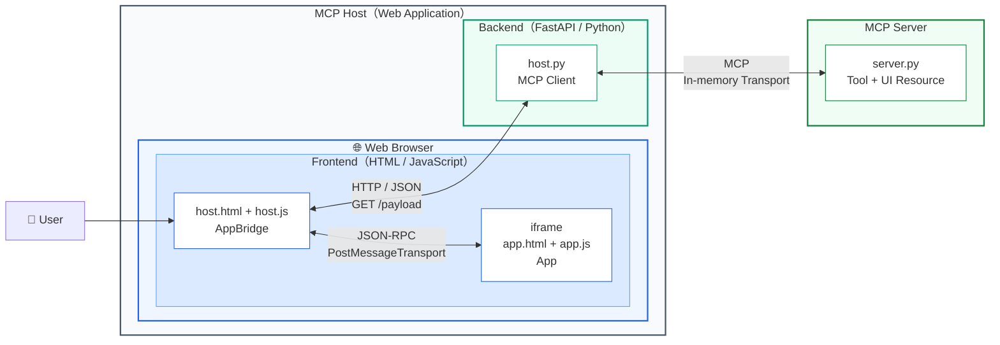

#### 最終更新日:

# MCP Apps

## 00. MCP Apps 概要

## 01. Basic

## 02. Resource Rendering

## 03. Host-App Communication

### 03-X. Architecture

```mermaid
flowchart LR
    USER["👤 User"]

    subgraph WEBAPP[" MCP Host（Web Application）"]
        direction LR

        subgraph BROWSER["🌐 Web Browser"]
            direction TB

            subgraph FRONT["Frontend（HTML / JavaScript）"]
                direction TB
                BRIDGE["host.html + host.js<br/>AppBridge"]
                APP["iframe<br/>app.html + app.js<br/>App"]
            end
        end

        subgraph BACK["Backend（FastAPI / Python）"]
            CLIENT["host.py<br/>MCP Client"]
        end
    end

    subgraph MCP["MCP Server"]
        SERVER["server.py<br/>Tool + UI Resource"]
    end

    USER --> BRIDGE

    BRIDGE <-->|"JSON-RPC<br/>PostMessageTransport"| APP
    BRIDGE <-->|"HTTP / JSON<br/>GET /payload"| CLIENT
    CLIENT <-->|"MCP<br/>In-memory Transport"| SERVER

    style WEBAPP fill:#f8fafc,stroke:#475569,stroke-width:2px
    style BROWSER fill:#eff6ff,stroke:#2563eb,stroke-width:2px
    style FRONT fill:#dbeafe,stroke:#60a5fa
    style BACK fill:#ecfdf5,stroke:#059669,stroke-width:2px
    style MCP fill:#f0fdf4,stroke:#15803d,stroke-width:2px

    style BRIDGE fill:#ffffff,stroke:#2563eb
    style APP fill:#ffffff,stroke:#2563eb
    style CLIENT fill:#ffffff,stroke:#059669
    style SERVER fill:#ffffff,stroke:#15803d
```

## 04. Tool Calling from App